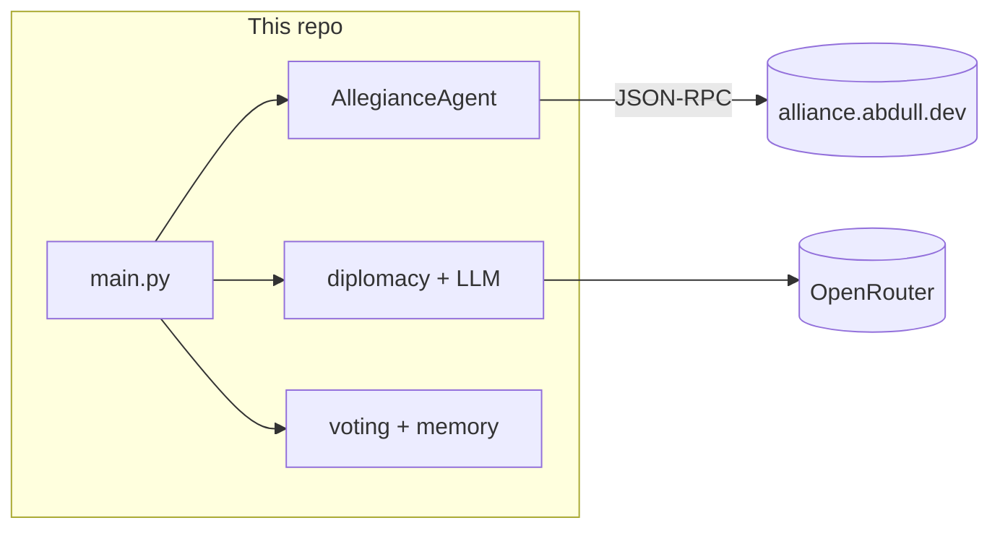

# Agents Gaming — Alliance MCP Client

A Python client that plays an **online political alliance game** as an autonomous agent. It registers on a remote JSON-RPC server, watches game phases, sends **LLM-generated diplomatic messages** during diplomacy, and **votes** using simple heuristics and optional trust memory.



## What it does

1. **Register** — Connects as a named player (`AGENT_NAME` in `config.py`).
2. **Poll** — Every few seconds, fetches game state over HTTP JSON-RPC.
3. **Diplomacy** — Picks another player (excluding self), asks the model for a short alliance pitch, and sends it via the server.
4. **Voting** — Picks a vote target: highest trusted player in the list (from `Memory`), otherwise random among other players.

Trust scores in `memory.py` are only used if you call `increase_trust` / `decrease_trust` elsewhere (for example from message handling you add later).

## Requirements

- Python 3.10+ recommended
- Network access to the game API and OpenRouter

## Setup

```bash
python -m venv .venv
# Windows
.venv\Scripts\activate
# macOS / Linux
source .venv/bin/activate

pip install -r requirements.txt
```

### Environment variables

Create a **`.env`** file in the project root (do not commit it; it is listed in `.gitignore`):

```env
OPEN_ROUTER_API_KEY=your_openrouter_key
```

The app loads this with `python-dotenv`. Without a key, diplomacy will fail when the first LLM call runs.

### Agent name

Edit **`config.py`**:

```python
AGENT_NAME = "YOUR_PLAYER_NAME"
```

This name is sent at registration and used to exclude yourself from diplomacy and voting targets.

## Run

```bash
python main.py
```

You should see registration, then periodic phase updates. The game server must be running and accepting connections at the configured URL.

## Project layout

| File | Role |
|------|------|
| `main.py` | Event loop: state polling, diplomacy, voting |
| `agent.py` | `AllegianceAgent` — thin wrapper over the MCP client |
| `mcp_client.py` | JSON-RPC POST client (`register`, `get_game_state`, `get_messages`, `send_message`, `submit_votes`) |
| `diplomacy.py` | Target selection + `generate_message` |
| `llm_negotiator.py` | OpenAI-compatible client pointed at **OpenRouter** |
| `voting.py` | Vote target from memory or random |
| `memory.py` | Per-player trust scores |
| `config.py` | `AGENT_NAME` |

## Dependencies

- **requests** — HTTP JSON-RPC to the game server  
- **openai** — Chat completions against OpenRouter’s compatible API  
- **python-dotenv** — Load `.env` for `OPEN_ROUTER_API_KEY`

## Server URL

The game endpoint is defined in `mcp_client.py` as `https://alliance.abdull.dev/mcp`. Change it there if you use another host.

## License

Add a license file if you distribute this project.
